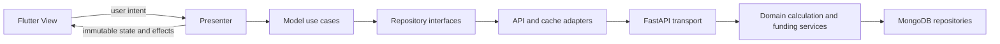

# Pocketwise: Model–View–Presenter architecture

Status: required target architecture. The existing prototype needs the migration below. “MVP” means **Model–View–Presenter**; first product scope is named **Release 1**.

## Boundaries

The Flutter application must follow MVP after the planned migration. The Python backend is a layered API/domain/repository service; HTTP routes are transport adapters, not Flutter presenters. Calling a backend route a controller does not make the client MVC, and renaming FinanceController alone does not implement MVP.

| Layer | Owns | Must not own |
|---|---|---|
| Model | Domain entities, typed repository interfaces, use cases, validation rules, local cache and data adapters behind interfaces | Flutter widgets, BuildContext, navigation or UI state |
| View | Flutter screens/widgets, displaying immutable state, forwarding user intent, rendering validation messages, navigation/dialog presentation | HTTP calls, storage access, funding decisions, financial formulas or orchestration of repositories |
| Presenter | View-state transitions, application action handling, calling model/use-case interfaces, mapping outcomes to display state/effects | Widgets/BuildContext, direct HTTP clients/database plugins, authoritative financial formulas |
| API transport | Authentication, request/response validation, error mapping, owner-scoped input handling | UI state, duplicated formula logic, unrestricted document access |
| Domain services | Ratios, commitment reconciliation, reservation invariants, idempotent purchase coordination | Flutter concerns, LLM-supplied arithmetic or unvalidated cross-user references |
| Repositories | MongoDB/local persistence, optimistic revisions and atomic transaction boundaries | Presentation or lender assumptions |

## Flow



A View subscribes to a presenter's read-only state and forwards events such as `loadMonth`, `submitTransaction`, `calculateScenario` or `allocateWishlistFunds`. The presenter has no Flutter imports; use plain Dart streams or equivalent observable abstractions and a widget-side lifecycle adapter. Subscription attachment/disposal belongs at the View boundary.

State includes loading/submitting status, data, field errors, general errors, freshness and read-only/offline restrictions. One-time navigation/messages use typed effects rather than passing BuildContext into the presenter. Cancelled or superseded requests cannot overwrite a newer selection. Repeated submission is guarded in the UI and made idempotent on the server where money/reservations are involved.

## Target organization

```text
mobile/lib/
  core/                      # shared domain types, errors, presentation contracts
  features/<feature>/
    model/                   # entities, use cases, repository interfaces
    presenter/               # presenter, immutable view state, effects
    view/                    # widgets and screens
    data/                    # repository implementation, DTOs, local/API adapters
  composition/               # dependency construction and injection
backend/app/
  api/                       # HTTP routers, auth dependencies, transport schemas
  domain/                    # entities, rules, calculation/funding use cases
  repositories/              # interfaces and MongoDB/local implementations
  infrastructure/            # settings, token, mail, storage, job adapters
```

Features: auth, transactions, categories, budgets, commitments, goals, financial_helper, wishlist, reports and settings. Avoid a single presenter owning the entire application. Session and selected-period state may be shared through model interfaces; a presenter may not reach into another presenter's mutable state.

No additional state-management package is mandated. The architecture is enforced by dependencies and tests rather than by choosing Provider/Riverpod/GetX or renaming folders.

## Calculation ownership and persistence

Money uses integer minor units; ratios/frequency conversions use decimal precision with explicit display rounding. Financial calculations are server-authoritative, deterministic and formula-versioned. Any later offline preview must be labelled provisional and use shared fixtures; the server recalculates before allocations/purchases.

Financial profiles, debt schedules, cash snapshots and reservations have separate purposes. Budgets do not create cash. The wishlist consumes a consistent snapshot of liabilities/reserves and a versioned aggregate, never the dashboard's incomplete net transaction total.

MongoDB is the production source of truth. Allocation/purchase operations need a transaction-capable deployment, stable idempotency keys and optimistic concurrency checks. A local repository must reproduce the same invariants for tests. The existing SQLite fallback is only a development tool; offline mobile storage is a separate adapter and has not been implemented.

## Security and lifecycle

Retain Argon2 password hashing, short-lived access JWTs, refresh rotation, owner checks and secure refresh-token storage. Add password reset, revocation policy, distributed rate limiting, secret management, HTTPS, encrypted deployment storage, backups and data export/deletion as R1 release work.

Presenters receive model outcomes for expired sessions rather than handling JWTs. Domain services verify ownership for every related ID. The client must not send trusted user IDs to override authenticated ownership.

## Prototype migration required

Observed before this documentation revision:

- `mobile/lib/controllers/finance_controller.dart` contains a shared ChangeNotifier controller tightly coupled to Api.
- `home_screen.dart` and `entry_editor.dart` call the API directly for several operations.
- `backend/app/main.py` combines routing, security, reports and business behavior.
- Financial helper, funding ledger and wishlist do not exist.

Migration order:

1. Capture current behavior through existing API/widget tests and typed contracts.
2. Introduce repository interfaces and use cases; inject API adapters at composition time.
3. Extract feature presenters with immutable states/effects and no widget/API dependencies.
4. Make Views forward all actions through presenters, including NLP, categories, budgets and account deletion.
5. Split backend routers from domain calculations and persistence; preserve existing API behavior during migration.
6. Add the financial profile, commitment, reservation and wishlist models/services using the target boundaries.
7. Replace controller-dependent tests and add architecture checks. Keep old controller code only while a feature is migrating; remove it once callers have moved.

## Architecture acceptance gates

- No View imports `http`, Api implementations, persistence plugins or database code; no View invokes `.api.request`.
- No presenter imports `package:flutter`, BuildContext, concrete HTTP or storage adapters.
- Presenters are constructible with fake model/repository interfaces and tested as plain Dart.
- Views can render loading, empty, error, success, incomplete and stale states using fake presenters.
- Domain tests own the financial examples and reservation invariants; widget tests do not define business rules.
- Backend financial outputs have matching contract fixtures consumed by client tests.
- Current prototype tests passing does not satisfy these gates until the migration exists.

## References

The financial formulas and sources live in [FINANCIAL_HELPER.md](FINANCIAL_HELPER.md). Data/endpoint contracts live in [DATA_AND_API.md](DATA_AND_API.md). Current implementation evidence lives in [STATUS.md](STATUS.md) and [TESTING.md](TESTING.md).
